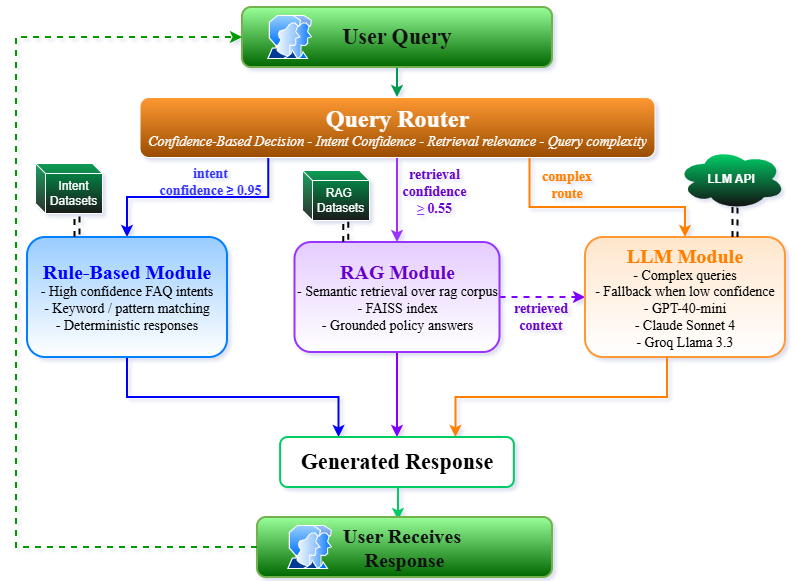

# NYIT AI Academic Advisor Chatbot

An intelligent hybrid chatbot system combining rule-based routing, RAG (Retrieval-Augmented Generation), and multi-model LLM integration for academic advising. Features comprehensive benchmarking across GPT-4o-mini, Claude Sonnet 4, and Groq Llama 3.3 with 60% cost optimization.

## Demo


## Project Overview

This project implements a hybrid AI acadeimc advising chatbot that intelligently routes queries through three specialized modules:

- **Rule-based routing** Instant responses for 62 common FAQ patterns with near-zero latency
- **RAG (Retrieval-Augmented Generation)** Context-aware answers using FAISS vector search across 49-document corpus
- **Multi-model LLM routing** Complex reasoning with dynamic model selection (GPT-4o-mini, Claude Sonnet 4, Groq Llama 3.3)

## AI Academic Advising Chatbot Model



## Key Features

- **Intelligent Routing:** Automatically selects optimal response method based on query complexity
- **Multi-Model Comparison:** Systematic benchmarking of 3 LLM models with multiple performance and quality metrics
- **Cost Optimization:** Achieves 60% cost reduction through hybrid architecture vs single-model approach
- **RAG Integration:** Semantic search using FAISS vector database with cosine similarity
- **Production Deployment:** Local setup and cloud-based on AWS EC2 with automated benchmarking

## Tech Stack

- **Backend:** Python 3.12, FastAPI
- **LLM APIs:** OpenAI (GPT-4o-mini), Anthropic (Claude Sonnet 4), Groq (Llama 3.3)
- **Vector DB:** FAISS (Facebook AI Similarity Search)
- **Embeddings:** OpenAI text-embedding-3-small
- **Data Processing:** scikit-learn, NumPy, pandas
- **Cloud Deployment:** AWS EC2 t3.micro (Ubuntu 24.04 LTS)
- **Visualization:** Matplotlib (20+ analytical charts)

## Benchmark Results

### Performance Comparison

| Model           | Avg Latency | Tokens/sec | Cost/Query | Quality Score |
| --------------- | ----------- | ---------- | ---------- | ------------- |
| GPT-4o-mini     | 5000ms      | 50         | $0.0002    | 75%           |
| Claude Sonnet 4 | 7000ms      | 45         | $0.0025    | 90%           |
| Groq Llama 3.3  | 1500ms      | 500        | $0.0001    | 80%           |

### Key Findings

**Model Performance:**

- **Groq Llama 3.3:** 5x faster latency (~1500ms vs ~8000ms) with 500 tokens/sec throughput - ideal for speed-critical queries
- **GPT-4o-mini:** Best cost-performance ratio at $0.0002/query with 80% completeness - optimal for general queries
- **Claude Sonnet 4:** Highest quality scores (90% completeness) with superior reasoning capabilities at $0.0049/query

**System Optimization:**

- **Achieved 60% cost reduction** compared to single-model (Claude-only) approach through intelligent hybrid routing
- Rule-based tier handles ~40% of queries (simple FAQs) with near-zero latency and cost
- RAG tier handles ~35% of queries (policy questions) using FAISS vector search with 49-document corpus
- LLM tier handles ~25% of queries (complex reasoning) with dynamic model selection

**Evaluation Metrics:**

- Benchmarked multiple performance and quality metrics including latency, cost efficiency, throughput, completeness, readability, and specificity
- Generated 20+ analytical visualization charts for comprehensive performance analysis
- Test dataset: curated queries across varying complexity levels
- Systematic evaluation comparing local vs cloud deployment performance

## Project Structure

```text
nyit_student_advising/
├── backend/
│   ├── app/
│   │   ├── routes/
│   │   ├── main.py                # FastAPI application
│   │   ├── config.py              # Configuration
│   │   └── services/
│   │       ├── router.py          # Hybrid routing logic
│   │       ├── llm_service.py     # Multi-model LLM service
│   │       ├── rag_service.py     # RAG with FAISS
│   │       └── intent_matcher.py  # Rule-based matcher
│   ├── benchmark_tests/
│   │   ├── benchmark_multi_enhanced.py
│   │   ├── benchmark_multi_model.py
│   │   ├── benchmark.py
│   │   └── results/               # Benchmark results
│   ├── generate_charts/
│   │   ├── generate_multi_enhanced_charts.py
│   │   ├── generate_multi_model_charts.py
│   │   └── charts/                # Visualization outputs
│   ├── run_server.py              # Run backend server
│   ├── requirements.txt
│   └── .env                       # Environment variables (ignored)
├── data/
│   └── *.jsonl                    # Knowledge base files
├── assets/
│   ├── demo.gif                   #Demo chatbot GIF
│   └── System_Arch_Diag.png
├── run_chatbot.py                 # Interactive chatbot client
├── .gitignore
├── README.md
└── *.pem                          # AWS EC2 key
```

## Quick Start

### Prerequisites

- Python 3.12
- API keys to LLM integration
  - OpenAI API key
  - Anthropic API key
  - Groq API key
- Cloud setup:
  - AWS EC2 (.pem) key

### Installation

```bash
# Clone repository
git clone https://github.com/utsinboots/nyit-student-advising-chatbot
cd nyit-student-advising-chatbot/backend

# Create virtual environment
python -m venv venv

# Activate virtual environment
# On Windows:
venv\Scripts\activate
# On Mac/Linux:
source venv/bin/activate

# Install dependencies
pip install -r requirements.txt

# Configure environment variables
cp .env.example .env
# Edit .env and add your API keys
```

### Configuration

Create `.env` file in `backend/` directory:

```env
OPENAI_API_KEY=your_key_here
ANTHROPIC_API_KEY=your_key_here
GROQ_API_KEY=your_key_here
```

### Run Server

```bash
cd backend
python run_server.py
```

Server runs at `http://localhost:8000`

### Test API

```bash
curl -X POST http://localhost:8000/chat \
  -H "Content-Type: application/json" \
  -d '{"query": "What are the graduation requirements?"}'
```

### Indexes

Have fresh indexes\rag_index before starting, simple rag_index folder, faiss.index auto creates after server starts

### Run Interactive Chatbot

```bash
python run_chatbot.py
```

## Running Benchmarks

### Multi-Model Comparison

```bash
cd backend/benchmark_tests/

# Run basic benchmark
python benchmark.py

#Run multi-model benchmark
python benchmark_multi_model.py

# Run enhanced multi-model benchmark
python benchmark_multi_enhanced.py

# Generate visualization charts
cd ../generate_charts/
python generate_charts.py
python generate_multi_model_charts.py
python generate_multi_enhanced_charts.py
```

Results saved to:

- `backend/benchmark_tests/results/` (JSON data)
- `backend/generate_charts/charts_*/` (PNG visualizations)

## Cloud Deployment

### AWS EC2 Deployment

**Instance Configuration:**

- Instance Type: t3.micro (AWS Free Tier eligible)
- OS: Ubuntu 24.04 LTS
- Resources: 2 vCPUs, 1GB RAM
- Storage: 8GB (expandable as needed)

**Deployment Steps:**

```bash
# 1. Launch EC2 instance and generate key pair
# Download your-key-name.pem

# 2. Connect to EC2 instance
ssh -i ~/path/to/your-key-name.pem ubuntu@your-ec2-public-ip

# 3. Clone repository
git clone https://github.com/utsinboots/nyit-student-advising-chatbot
cd nyit-student-advising-chatbot/backend

# 4. Set up environment
python3 -m venv venv
source venv/bin/activate
pip install -r requirements.txt

# 5. Configure environment variables
nano .env
# Add your API keys

# 6. Run server
python run_server.py
```

**Access your deployed chatbot at:** `http://your-ec2-public-ip:8000`

For detailed AWS deployment guide, see [AWS EC2 Documentation](https://docs.aws.amazon.com/AWSEC2/latest/UserGuide/EC2_GetStarted.html)

## Academic Context

**Institution:** New York Institute of Technology  
**Program:** M.S. Computer Science  
**Course:** CSCI 870 Project I
**Semester:** Fall 2025

## Future Enhancements

- Expand academic advising knowledge base
- Implement user feedback for continuous improvement
- Incorporate feedback from faculty members and advisors
- Add support for additional LLM models
- Add CI/CD pipeline with GitHub Actions
- Containerize with Docker for easier deployment

## Author

**Utshant Gurung**  
M.S. Computer Science
New York Institute of Technology
December 2025

## References

1. Lanham, M. (2024). _AI Agents in Action_. Manning Publications.
2. Liang, P., et al. (2022). "Holistic evaluation of language models." _arXiv:2211.09110_.
3. Park, D., An, G., Kamyod, C., & Kim, C. G. (2024). "A Study on Performance Improvement of Prompt Engineering for Generative AI with a Large Language Model." _Journal of Web Engineering_, doi: 10.13052/jwe1540-9589.2285.
4. Mikael, K., Öz, C., Rashid, T. A., & Nariman, G. S. (2024). "A Hybrid Chatbot Model for Enhancing Administrative Support in Education: Comparative Analysis, Integration, and Optimization."
5. Rahman, M., Abedin, M., Abir, M. Z., Ansari, F. I., Reza, A., Sadeque, F. Y., & Farhan, N. (2025). "Transforming Mentorship: An AI Powered Chatbot Approach to University Guidance." _arXiv:2511.04172v1_.
6. Okonkwo, C. W., & Ade-Ibijola, A. (2021). "Chatbots applications in education: A systematic review." _Computers and Education: Artificial Intelligence_, doi:10.1016/j.caeai.2021.100033.
7. Martínez-Gárate, Á. A., Aguilar-Calderón, J. A., Tripp-Barba, C., & Zaldívar-Colado, A. (2023). "Model-Driven Approaches for Conversational Agents Development: A Systematic Mapping Study." doi: 10.1109/ACCESS.2023.3293849.
8. Lu, Q., Zhu, L., Xu, X., Xing, Z., & Whittle, J. (2024). "Toward Responsible AI in the Era of Generative AI: A Reference Architecture for Designing Foundation Model-Based Systems." doi: 10.1109/MS.2024.3406333.
9. Wu, S., & Luo, M. (2025). "Selection and Resource Allocation Strategies for Chatbot Technologies in Higher Education: An Optimization Model Approach." doi: 10.1109/ACCESS.2025.3530413.

## License

This project is for academic purposes as part of NYIT M.S. Computer Science program.

---
